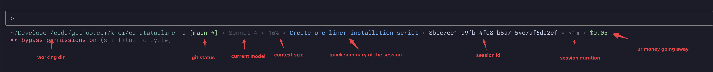

# statusline-rs



## Quick Start

### Install

```bash
git clone https://github.com/khoi/cc-statusline-rs && cd cc-statusline-rs && make install
```

The installation automatically configures your `~/.claude/settings.json` with the statusline.
