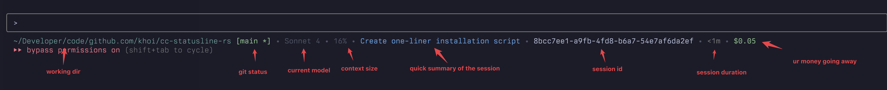

# cc-statusline-rs

A statusline for Claude Code.

Idea from https://gist.github.com/steipete/8396e512171d31e934f0013e5651691e.



## Prerequisites

- Rust (install from [rustup.rs](https://rustup.rs/))

## Quick Start

### Install

```bash
git clone https://github.com/pythoninthegrass/cc-statusline-rs \
    && cd cc-statusline-rs \
    && make install
```

The installation automatically configures your `~/.claude/settings.json` with the statusline.
